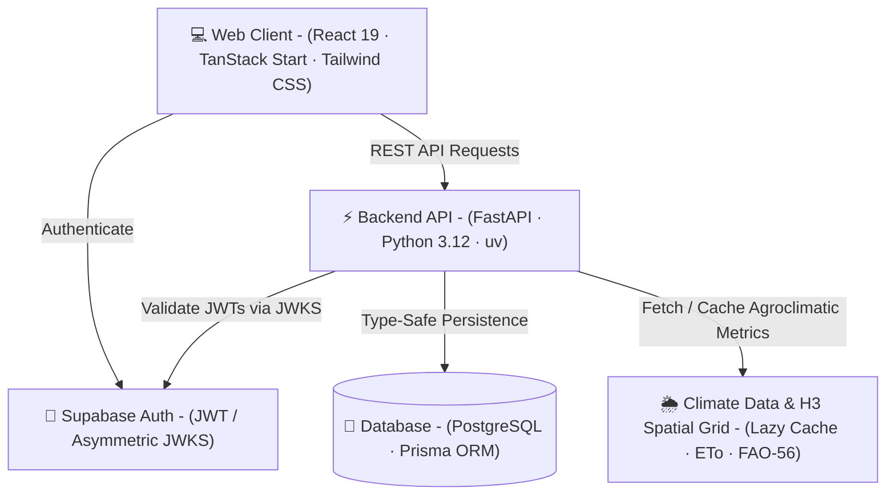

# Irrigai 🌱

> Climate-aware smart irrigation management system translating meteorological data, crop phenology (FAO-56), and infrastructure parameters into precise irrigation recommendations.

---

## 🏛️ Architecture Overview



### Tech Stack & Modules

- **Frontend**: React 19, TanStack (Start, Router, Query), Tailwind CSS v4, Biome.
- **Backend**: FastAPI, Python 3.12, `uv`, Prisma Client Python, Pydantic.
- **Database & Auth**: Supabase PostgreSQL & Supabase Auth (stateless JWKS verification).
- **Core Engine**: FAO-56 calculation engine, Uber H3 spatial indexing, and 30-day climate caching.

---

## 🔄 How It Works

1. **Property & Crop Setup**: Farmer registers property (mapped to an H3 hex cell) and crop configurations.
2. **Climate Retrieval**: System fetches and caches reference evapotranspiration ($ET_0$) and weather metrics.
3. **Irrigation Calculation**: Computes crop evapotranspiration ($ET_c = ET_0 \times K_c$), water depth, and pump runtimes.
4. **Immutable Snapshots**: Every calculation is stored as an immutable snapshot for historical auditability.

---

## 🚀 Quick Start

```bash
# Backend
cd backend && uv sync && docker compose up

# Frontend
cd frontend && npm install && npm run dev
```
