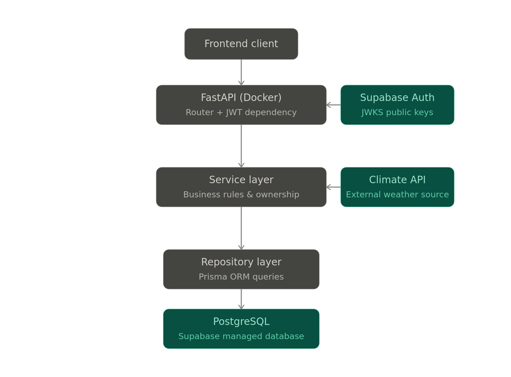

# Irrigai
Irrigai is a climate-aware irrigation management system for Brazilian farmers. The domain focuses on translating climate data + crop characteristics + irrigation infrastructure into precise irrigation recommendations.

## Stack & Architecture
Irrigai's backend is built with FastAPI on Python 3.12, using uv for dependency and environment management and Prisma as the ORM for type-safe access to a PostgreSQL database provisioned by Supabase. Authentication is delegated entirely to Supabase Auth: the API validates incoming JWTs against Supabase's public JWKS endpoint (asymmetric signing keys), so no shared secret needs to be stored or rotated manually. Each module (properties, crops, irrigation, climate) follows a layered architecture — router (HTTP layer) → service (business rules) → repository (the only layer allowed to touch Prisma) — keeping data-access concerns isolated from domain logic. Since Prisma bypasses Supabase's Row-Level Security, every repository enforces user-level data isolation explicitly by filtering on user_id (or through the ownership chain user_id → property_id → crop_id), rather than relying on database-level policies. The app is containerized with a multi-stage Docker build (build tools stripped from the final image, non-root runtime user) and orchestrated locally via Docker Compose, running alongside a local Supabase instance for development. Irrigation recommendations are computed from live climate data (cached per municipality/month to minimize external API calls) and crop/system configuration, and every calculation is persisted as an immutable snapshot to guarantee historical traceability of past recommendations.



## Run Project

### First time setup
Copy the example env file and fill in your local Supabase credentials: ```cp .env.example .env```

Sync dependencies and create the virtual environment: ```uv sync```

### Start Supabase: 
```supabase start```

Copy the URLs and keys printed in the terminal output into your `.env` file
(`SUPABASE_URL`, `DATABASE_URL`, `SUPABASE_PUBLISHABLE_KEY`, `SUPABASE_SECRET_KEY`).

### Every time you alter the Prisma schema: 
```uv run prisma migrate dev --name <describe_your_change>```

### Every time you alter dependencies (pyproject.toml)
Update the lockfile before rebuilding, otherwise the Docker build will fail: ```uv lock```

### Every time you alter dependencies or the Prisma schema
(after Supabase is started and migrations are applied): ```docker compose up --build```

### Just run
(after Supabase is started and migrations are applied): ```docker compose up```

### Stop everything: 
```docker compose down; supabase stop```

## Dirs Structure
```
backend/
├── prisma/                     # Prisma configuration directory
│   └── schema.prisma           # Single Prisma schema (models, relations, and connections)
├── src/
│   ├── core/                   # Global configurations and base infrastructure
│   │   ├── __init__.py
│   │   ├── config.py           # Environment variables (Pydantic Settings)
│   │   ├── database.py         # Prisma Client instantiation and lifecycle
│   │
│   ├── modules/                # Organization by Features / Domains
│   │   ├── properties/         # Feature: Property Registration
│   │   │   ├── __init__.py
│   │   │   ├── router.py       # Property endpoints (/properties)
│   │   │   ├── schemas.py      # PropertyCreate, PropertyResponse, etc.
│   │   │   ├── service.py      # Rules (uniqueness per farmer, validations)
│   │   │   └── repository.py   # Database queries via Prisma Client
│   │   │
│   │   ├── crops/              # Feature: Crop Registration (Crops)
│   │   │   ├── __init__.py
│   │   │   ├── router.py       # Crop endpoints (/crops)
│   │   │   ├── schemas.py      # CropCreate, CropResponse, StageEnum
│   │   │   ├── service.py      # Business rules (dates, FAO-56 stages)
│   │   │   └── repository.py   # Database queries via Prisma Client
│   │   │
│   │   ├── irrigation/         # Feature: Irrigation Systems & Calculations
│   │   │   ├── __init__.py
│   │   │   ├── router.py       # Endpoints for systems and calculation runs
│   │   │   ├── schemas.py      # Irrigation and snapshot schemas
│   │   │   ├── service.py      # Algorithm, ClimateData caching, and snapshots
│   │   │   └── repository.py   # Database queries via Prisma Client
│   │   │
│   │   └── climate/            # Feature: Climate Data
│   │       ├── __init__.py
│   │       ├── service.py      # Lazy-loading logic and 30-day cache expiration
│   │       └── repository.py   # Database queries via Prisma Client
│   │
│   ├── middlewares/            # Global middlewares (e.g., error handling)
│   │   ├── __init__.py
│   │   └── error_handler.py
│   │
│   ├── dependencies.py         # FastAPI dependencies (e.g., get_current_user extracting JWT)
│   └── main.py                 # Application entry point (FastAPI app, Prisma lifespan)
│
├── .env                        # Environment variables (Supabase DATABASE_URL)
├── .env.example
├── docker-compose.yml
├── Dockerfile                  # Backend containerization
├── pyproject.toml              # Python dependencies (including prisma-client-py)
└── README.md
```